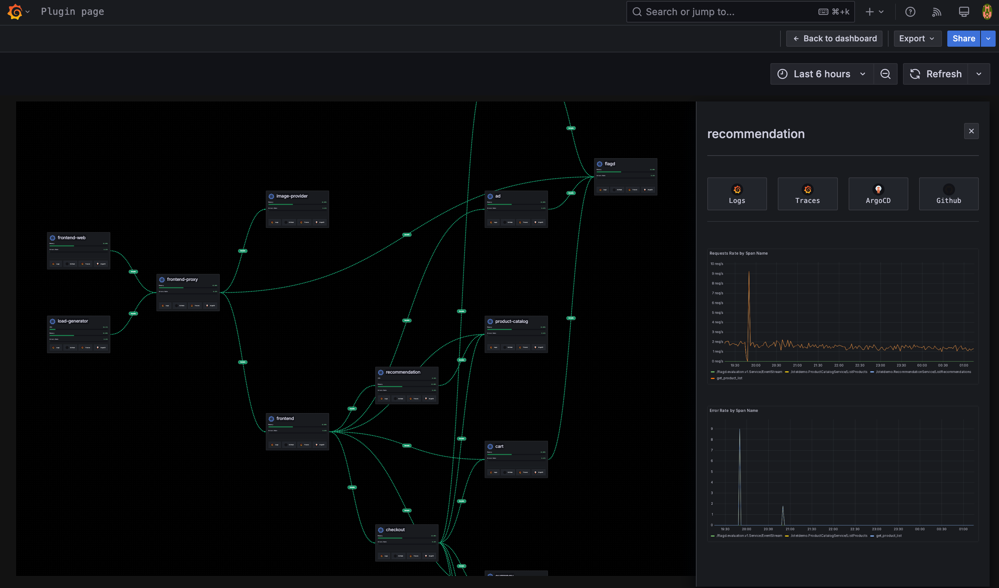

# Kubiks - Service Map Visualization Panel for Grafana


[](https://opensource.org/licenses/Apache-2.0)
[](https://grafana.com)
[](https://nodejs.org)

> A powerful service map visualization panel for monitoring and observing distributed systems and microservices architecture in Grafana.

## ✨ Features

### 🗺️ Interactive Service Maps
- **Dynamic Visualization**: Transform your metrics into interactive service topology maps
- **Multiple Layout Algorithms**: Tree, grid, and force-directed layouts
- **Infinite Canvas**: Pan, zoom, and explore large service topologies with ease
- **Real-time Updates**: Live monitoring with automatic data refresh

### 🎨 Rich Configuration
- **Flexible Elements**: Services, connections, and groups with custom styling
- **Layout Items**: Progress bars, status indicators, metrics, tags, and more
- **Data Integration**: Connect to any Grafana data source
- **Dashboard Embedding**: Include panels and link to detailed dashboards

### 🔍 Advanced Interactions
- **Service Details**: Click to view comprehensive service information
- **Connection Analysis**: Hover for traffic metrics and error rates
- **Context Actions**: Right-click menus for quick navigation
- **Search & Filter**: Find and highlight specific services



## 🚀 Quick Start

### Installation

1. **From Grafana Catalog** (Recommended)
   - Go to your Grafana instance
   - Navigate to Administration → Plugins
   - Search for "Kubiks"
   - Click Install

2. **Manual Installation**
   ```bash
   # Download the latest release
   wget https://github.com/kubiks-inc/kubiks-grafana-plugin/releases/latest/download/kubiks-panel.zip
   
   # Extract to Grafana plugins directory
   unzip kubiks-panel.zip -d /var/lib/grafana/plugins/
   
   # Restart Grafana
   sudo systemctl restart grafana-server
   ```

### Basic Usage

1. **Create a Panel**
   - Add a new panel to your dashboard
   - Select "Kubiks" as the visualization type

2. **Configure Data Source**
   - Connect to your monitoring data source
   - Create queries returning service metrics

3. **Add Elements**
   - Click "Add Element" in the panel editor
   - Configure element type and data source mapping
   - Add layout items to display metrics and status

4. **Customize Layout**
   - Choose layout algorithm (tree, grid, force)
   - Configure visual styling and interactions
   - Save and enjoy your service map!

## 📊 Data Requirements

### Basic Structure
Your queries should return data with at least:
- **Time field**: Timestamp for time-series data
- **Service identifier**: Field identifying each service (default: `service_name`)
- **Metrics**: Values to display (CPU, memory, status, etc.)

### Example Query (Prometheus)
```promql
# Service metrics
avg_over_time(cpu_usage{job="services"}[5m])

# Service status
up{job="services"}

# Connection data (for topology)
sum(rate(http_requests_total[5m])) by (source_service, target_service)
```

### Supported Data Sources
- Prometheus
- InfluxDB
- Elasticsearch
- PostgreSQL/MySQL
- Grafana TestData
- Any data source returning time-series or table data

## 🛠️ Development

### Prerequisites
- Node.js 22+
- Go 1.21+ (for backend)
- Docker (optional, for testing)

### Setup
```bash
# Clone the repository
git clone https://github.com/kubiks-inc/kubiks-grafana-plugin.git
cd kubiks-grafana-plugin

# Install dependencies
npm install

# Start development server
npm run dev
```

### Building
```bash
# Frontend build
npm run build

# Backend build (cross-platform)
mage -v

# Run tests
npm run test:ci

# Lint and format
npm run lint:fix
```

### Testing
```bash
# Start test environment
npm run server

# Run E2E tests
npm run e2e

# Test with specific Grafana version
GRAFANA_VERSION=11.3.0 npm run server
```

## 📖 Documentation

### Configuration Guides
- **[Complete Documentation](./PLUGIN_DOCUMENTATION.md)** - Comprehensive guide
- **[Element Configuration](./docs/elements.md)** - Configuring service elements
- **[Layout Items](./docs/layout-items.md)** - Available display options
- **[Data Integration](./docs/data-integration.md)** - Connecting data sources

### API Reference
- **[Plugin API](./docs/api.md)** - Backend API endpoints
- **[Data Models](./docs/models.md)** - TypeScript interfaces
- **[Theming](./docs/theming.md)** - Customization options

## 🏗️ Architecture

### Frontend (TypeScript/React)
- **ReactFlow**: Canvas rendering and interactions
- **Zustand**: State management
- **TailwindCSS**: Styling and theming
- **@grafana/ui**: Grafana UI components

### Backend (Go)
- **Grafana Plugin SDK**: Backend framework
- **Data Processing**: Query transformation and caching
- **Health Checks**: Service monitoring endpoints

### Layout Algorithms
- **Dagre**: Hierarchical tree layouts
- **D3-Force**: Physics-based positioning
- **Custom Grid**: Organized grid arrangements

## 🤝 Contributing

We welcome contributions! Please see our [Contributing Guide](./CONTRIBUTING.md) for details.

### Development Process
1. Fork the repository
2. Create a feature branch
3. Make your changes
4. Add tests if applicable
5. Submit a pull request

### Reporting Issues
- [Bug Reports](https://github.com/kubiks-inc/kubiks-grafana-plugin/issues/new?template=bug_report.md)
- [Feature Requests](https://github.com/kubiks-inc/kubiks-grafana-plugin/issues/new?template=feature_request.md)

## 📝 Release Notes

### Version 0.3.1 (Current)
- Enhanced layout algorithms
- Improved performance for large topologies
- Better dashboard integration
- Bug fixes and stability improvements

See [CHANGELOG.md](./CHANGELOG.md) for complete release history.

## 📋 Requirements

### Grafana Compatibility
- **Minimum Version**: Grafana 10.4.0+
- **Recommended**: Grafana 11.0.0+
- **Tested Versions**: 10.4.x, 11.0.x, 11.3.x

### Browser Support
- Chrome 90+
- Firefox 88+
- Safari 14+
- Edge 90+

## 🔒 Security

### Plugin Signing
This plugin is signed by Grafana for security and integrity. The signing process ensures:
- Authenticity of the plugin code
- Protection against tampering
- Compliance with Grafana security standards

### Data Privacy
- No data is sent to external services
- All processing happens within your Grafana instance
- Secure handling of dashboard variables and queries

## 📄 License

This project is licensed under the Apache License 2.0 - see the [LICENSE](LICENSE) file for details.

## 🔗 Links

- **Website**: [kubiks.ai](https://kubiks.ai)
- **Documentation**: [Plugin Documentation](./PLUGIN_DOCUMENTATION.md)
- **Issues**: [GitHub Issues](https://github.com/kubiks-inc/kubiks-grafana-plugin/issues)
- **Discussions**: [GitHub Discussions](https://github.com/kubiks-inc/kubiks-grafana-plugin/discussions)
- **Sponsor**: [GitHub Sponsors](https://github.com/sponsors/kubiks-inc)

## 💖 Support

If you find this plugin useful, please consider:
- ⭐ Starring the repository
- 🐛 Reporting bugs and issues
- 💡 Suggesting new features
- 💰 [Sponsoring development](https://github.com/sponsors/kubiks-inc)

---

**Built with ❤️ by the Kubiks team for the Grafana community.**
